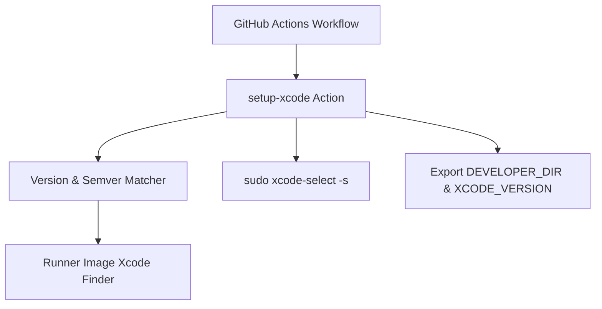

# System architecture

```mermaid
graph TD
    Workflow[GitHub Actions Workflow] --> Action[setup-xcode Action]
    Action --> Resolver[Version & Semver Matcher]
    Resolver --> Finder[Runner Image Xcode Finder]
    Action --> Select[sudo xcode-select -s]
    Action --> Env[Export DEVELOPER_DIR & XCODE_VERSION]
```
