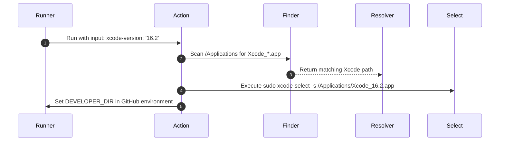

# Key flows

```mermaid
sequenceDiagram
    autonumber
    Runner->>Action: Run with input: xcode-version: '16.2'
    Action->>Finder: Scan /Applications for Xcode_*.app
    Finder-->>Resolver: Return matching Xcode path
    Action->>Select: Execute sudo xcode-select -s /Applications/Xcode_16.2.app
    Action->>Runner: Set DEVELOPER_DIR in GitHub environment
```
